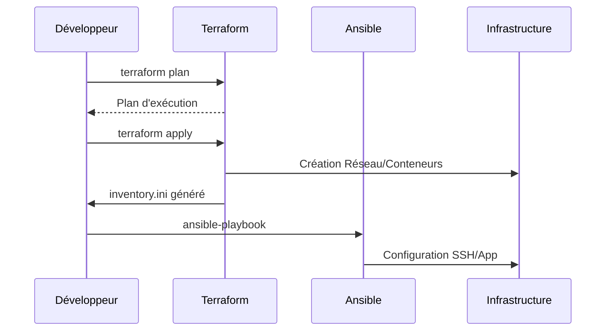

# 🎓 DevOps Local Lab — Terraform + Ansible

[](https://USERNAME.github.io/REPO_NAME/)

> **Apprenez l'Infrastructure as Code (IaC) en local avec Docker, sans frais Cloud.**

Ce dépôt est un **laboratoire pratique (TP) complet** conçu pour maîtriser les interactions entre le Provisioning (Terraform) et la Configuration (Ansible).

## 📘 Accès au Workshop

Ce dépôt propose **deux formats complémentaires** pour apprendre l'IaC :

### 🎓 Format Workshop (MOAW) — Formation en direct
- **Objectif** : Présentation guidée par un formateur
- **Format** : Condensé, slides interactifs
- **Durée** : ~2h30 en classe
- **Accès** :
  - **[👉 Lancer le Workshop en ligne](https://othila-academy.github.io/workshop-terraform-ansible/)** (Via GitHub Pages)
  - **Preview Locale** :
    ```bash
    npm install
    npm run docs:serve
    # Accédez à http://localhost:4444
    ```

### 📝 Format Exercices — Auto-formation
- **Objectif** : Apprentissage autonome approfondi
- **Format** : Guides détaillés pas-à-pas avec critères de validation
- **Durée** : ~2h30 à votre rythme
- **Accès** : Consultez le dossier [`exercises/`](exercises/) et commencez par le [README des exercices](exercises/README.md)

> 💡 **Conseil** : Les deux formats suivent la même progression. Utilisez le workshop MOAW pour une vue d'ensemble rapide, puis pratiquez avec les exercices détaillés.

---

## 📑 Table des Matières
1. [Architecture & Design](#-architecture--design)
2. [Concepts Théoriques](#-concepts-théoriques)
3. [Pré-requis](#-pré-requis)
4. [Le Parcours Pédagogique (Exercices)](#-le-parcours-pédagogique)
5. [Workflow DevOps](#-workflow-devops)
6. [Utilisation Rapide](#-utilisation-rapide)
7. [FAQ & Troubleshooting](#-faq--troubleshooting)

---

## 🏗 Architecture & Design

Nous simulons une architecture **3-tier** moderne en utilisant des conteneurs Docker au lieu de serveurs cloud coûteux.

### Schéma d'Architecture
```mermaid
graph TD
    User((Utilisateur)) -->|HTTP :8080| NG[Nginx Reverse Proxy]
    
    subgraph "Docker Network (devops-local-lab-nets)"
        NG -->|Proxy Pass :5000| APP[Flask Application]
        ANS_VM[Container "VM-Like" SSH Target]
    end
    
    TF[Terraform] -->|Provisionne| DockerAPI[(Docker Engine)]
    ANS[Ansible] -->|Configure via SSH :2222| ANS_VM
    ANS -.->|Déploie| APP
    ANS -.->|Configure| NG
```

### Composants
1.  **Frontend / Gateway** : `nginx:alpine`
    *   Expose le port **8080** sur l'hôte.
    *   Route le trafic vers l'API interne via la résolution DNS Docker.
2.  **Backend** : `flask-app` (Python 3.9)
    *   API REST simple renvoyant des métadonnées (Hostname, Env, Time).
    *   Non accessible directement depuis l'extérieur (Isolé).
3.  **Administration** : `vm-like` (OpenSSH Server)
    *   Conteneur spécial simulé une VM Linux standard.
    *   Permet à Ansible de se connecter en SSH (Port 2222) pour exécuter des rôles.

---

## 📚 Concepts Théoriques

### 1. Le Spectre IaC (Infrastructure as Code)
| Outil | Rôle Principal | Analogie BTP | État |
| :--- | :--- | :--- | :--- |
| **Terraform** | **Provisioning** | Le Maçon (Murs, Tuyaux) | Déclaratif (Je veux un mur ici) |
| **Ansible** | **Configuration** | L'Électricien/Peintre | Impératif/Procédural (Peins ce mur en blanc) |

*Note: Ansible est aussi déclaratif, mais son exécution est séquentielle.*

### 2. Le Cycle de Vie & le State
Terraform maintient un fichier `terraform.tfstate`. C'est la **seule source de vérité**.
*   **Drift** : Si quelqu'un supprime un conteneur manuellement via `docker rm`, Terraform le détectera comme une "dérive" (drift) par rapport au State et le recréera au prochain `apply`.

### 3. Idempotence & Robustesse
Un script Ansible doit pouvoir être lancé **100 fois** sans casser la production.
*   *Mauvais* : `apt-get install nginx` (échoue si déjà installé ou verrouillé).
*   *Bon* : Module `apt: name=nginx state=present` (Vérifie, puis installe si nécessaire).

---

## 🛠 Pré-requis

| Outil | Version Min | Rôle |
| :--- | :--- | :--- |
| **Docker** | 20.x | Moteur de virtualisation |
| **Terraform** | 1.5.x | Orchestrateur d'infrastructure |
| **Ansible** | 2.15.x | Gestionnaire de configuration |
| **Make** | 3.x | Automatisation des tâches |
| **Python** | 3.9+ | Pour l'application Flask |

> ⚠️ **Utilisateurs Windows** : Ansible **ne fonctionne pas** nativement sous Windows. Vous devez impérativement utiliser **WSL2** (Windows Subsystem for Linux).

### Vérification
```bash
make --version && docker --version && terraform -version && ansible --version
```

---

## 🚀 Le Parcours Pédagogique

Chaque dossier dans `exercises/` est une étape vers la maîtrise.

### Phase 1 : Les Fondations (Terraform)
*   **[Ex01 : Hello Infra](exercises/ex01-terraform-hello-infra-plan-apply-destroy/)**
    *   *Objectif* : Lancer votre premier conteneur Nginx via Terraform.
    *   *Commandes* : `terraform init`, `plan`, `apply`, `destroy`.
*   **[Ex02 : Variables & Environnements](exercises/ex02-terraform-variables-workspaces-dev-prod/)**
    *   *Objectif* : Gérer un environnement "DEV" et "PROD" avec le même code.
    *   *Notions* : `variables.tf`, `terraform.tfvars`, Workspaces.

### Phase 2 : L'Intégration (Terraform 🤝 Ansible)
*   **[Ex03 : Inventaire Dynamique](exercises/ex03-terraform-ansible-generer-inventory-ini-automatiquement/)**
    *   *Objectif* : Ne plus jamais écrire d'adresses IP à la main.
    *   *Notions* : `resource "local_file"`, Template Strings, Outputs.

### Phase 3 : Configuration Avancée (Ansible)
*   **[Ex04 : Bootstrap & Déploiement](exercises/ex04-ansible-bootstrap-docker-deploiement-app-idempotence/)**
    *   *Objectif* : Installer Docker DANS un conteneur et y déployer l'app.
    *   *Notions* : Rôles, `community.docker`, Idempotence.
*   **[Ex05 : Handlers & Proxy](exercises/ex05-ansible-nginx-reverse-proxy-handlers/)**
    *   *Objectif* : Configurer un Reverse Proxy qui se recharge uniquement quand la config change.
    *   *Notions* : Jinja2 Templates, Handlers (`notify`), Services.

### Phase 4 : Industrialisation
*   **[Ex06 : CI/CD Local](exercises/ex06-chainage-makefile-mini-ci-cd-local/)**
    *   *Objectif* : "One Button Deployment".
    *   *Notions* : `Makefile`, dépendances de tâches, automatisation.

---

## 🔄 Workflow DevOps

Voici le cycle de développement que nous adopterons durant ce TP :

1.  **Code** : Modification des fichiers `.tf` ou des playbooks `.yml`.
2.  **Lint** (Qualité) : Vérification de la syntaxe.
    *   `terraform fmt`
    *   `ansible-lint`
3.  **Plan** (Simulation) :
    *   `terraform plan` (Quoi va changer ?)
    *   `ansible-playbook --check` (Dry Run)
4.  **Apply** (Déploiement) :
    *   Application réelle des changements.
5.  **Test** :
    *   `curl localhost:8080/health`



---

## ⚡️ Utilisation Rapide (Solution Complète)

Si vous voulez voir le résultat final immédiatement :

1.  **Construire l'app** : `docker build -t devops-local-lab-flask:latest app/`
2.  **Déployer** : `make deploy`
3.  **Vérifier** : `curl http://localhost:8080`
4.  **Détruire** : `make destroy`

---

## ❓ FAQ & Troubleshooting

**Q : `Bind for 0.0.0.0:8080 failed: port is already allocated`**
> **R :** Un autre service utilise ce port. Modifiez `variable "host_http_port"` dans `infra/terraform/variables.tf`.

**Q : Erreur SSH `Permission denied (publickey,password)`**
> **R :** Vérifiez que le conteneur `vm-like` est bien lancé (`docker ps`). Le mot de passe par défaut est configuré dans le code Terraform (`ansible`/`ansible`).

**Q : Pourquoi Docker-in-Docker ?**
> **R :** Pour l'exercice 04, nous simulons l'installation de Docker SUR une machine cible. Comme notre cible est déjà un conteneur, c'est techniquement du Docker-in-Docker (ou plutôt Docker-adjacent via le socket). C'est uniquement pour la pédagogie.

---
*Happy Hacking!*
